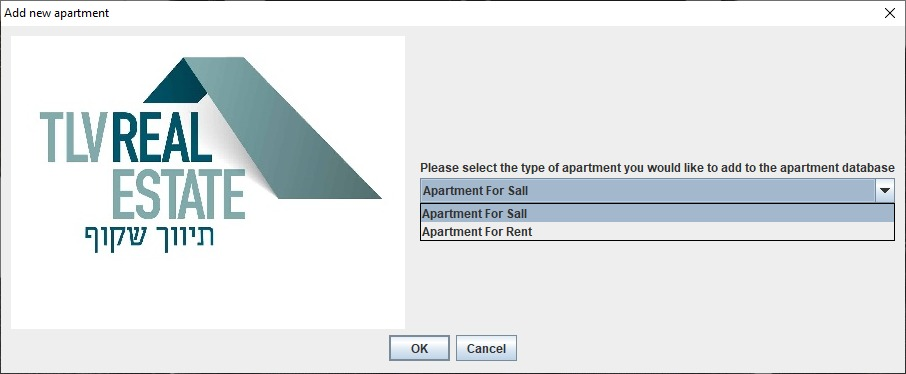

# Shakuf-Real-estate
A personal project I created, I built a desktop application for a system for managing an apartment brokerage company, the system is written in pure Java with a GUI system from javax.swing
<h3>Main menu</h3>
The first munu that pop when you open the application, Some of them will open submenus when selected, I will explain those submenus later.
<ul>
  <li>Add new apartment</li>
  <li>Finc appartment</li>
  <li>Show all apartments</li>
  <li>Sort apartments</li>
  <li>Exit</li>
</ul>

<h3>Add new apartment</h3>
The user can choose between two types of apartments, the first is an apartment for sale and the second is an apartment for rent.
<ul>
  <li>Apartment for sall</li>
  <li>Apartment for Rent</li>
</ul>

<h3>Sort apartments</h3>
The user can choose to sort his list of apartments, he has three options to sort. The first is sorting by price, the second option is sorting by customer name and the third option is by the ID of the apartments.
<ul>
  <li>Sort by Price</li>
  <li>Sort by Client Names</li>
  <li>Sort by ID's</li>
</ul>

<h3>Show all apartments</h3>
This option will show the user the list of apartments.

<h3>Exit</h3>
This option will close the window and exit the program.

