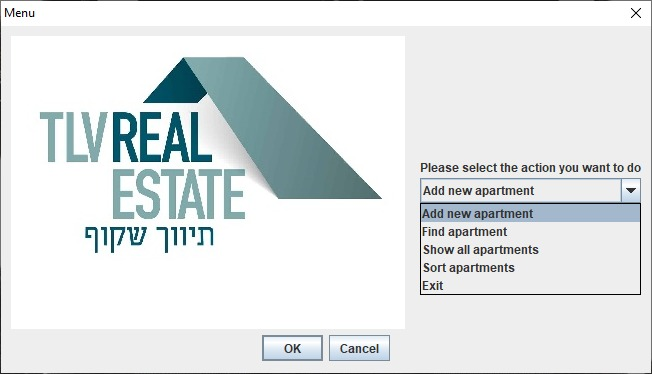

# Shakuf-Real-estate
A personal project I created, I built a desktop application for a system for managing an apartment brokerage company, the system is written in pure Java with a GUI system from javax.swing
<h3>Main menu</h3>
The first munu that pop when you open the application
<ul>
  <li>Coffee</li>
  <li>Tea</li>
  <li>Milk</li>
</ul>

